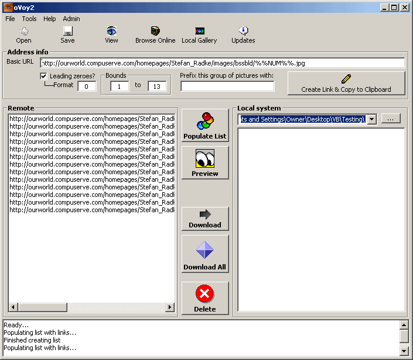



## Gallery Browser/Downloader

### Description

This is an improvement to a previous program. Features include: saving config files for use later, browse galleries online, watch a series of pictures like a slideshow with the use of timers, download an entire numbered series of files(not just pictures) to your computer, create and trade custom protocol urls, check for updates online(source for updater is included. it can EASILY be fitted to be an updater for any program), an admin panel to change the update message via FTP and there's a dynamic menu to hold 'favorites'. To use this, enter a url in the box like this: http://www.website.com/images/picture%%NUM%%.jpg . As long as the picture names are all the same except for an index number, replace the number itself with %%NUM%%, fill in the leading zeroes and boundaries accordingly, click populate list and go from there. It's an awesome downloader if you have broadband(although only picture files appear in the local folder list, it WILL download any file type like movies etc). You can even prefix entire sets of files. It is only lightly commented so feel free to ask questions.
 
### More Info
 

             |
---                |---
**Submitted On**   |2004-04-24 22:06:02
**By**             |[C\.Smith](https://github.com/Planet-Source-Code/PSCIndex/blob/master/ByAuthor/c-smith.md)
**Level**          |Advanced
**User Rating**    |5.0 (20 globes from 4 users)
**Compatibility**  |VB 6\.0
**Category**       |[Complete Applications](https://github.com/Planet-Source-Code/PSCIndex/blob/master/ByCategory/complete-applications__1-27.md)
**World**          |[Visual Basic](https://github.com/Planet-Source-Code/PSCIndex/blob/master/ByWorld/visual-basic.md)
**Archive File**   |[Gallery\_Br1737504252004\.zip](https://github.com/Planet-Source-Code/c-smith-gallery-browser-downloader__1-53383/archive/master.zip)

